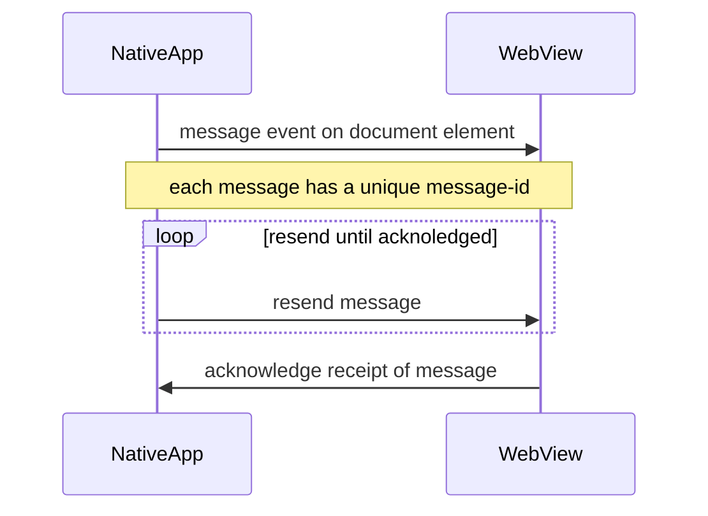

# Native app integration

## Overview

## Communication

The web app and the native app must communicate
with each other in order to work together.

### Web app to native app

The web app can communicate with the native app
via the postMessage API. The native app will
listen for messages on the `window`-object.

### Asynchronos communication between native app and web app

Since the native app and the web app are communicating in an asynchronous manner, there is a risk that messages are lost.
To prevent this, the native-app will resend messages until it receives an acknowledgement from the web app.

#### Events that are sent by the web app

| Message       | Payload            | Description                                                      |
| ------------- | ------------------ | ---------------------------------------------------------------- |
| `routeChange` | `\{ url: string }` | Inform the app that the webview nagivated to the following URL ` |
| …             | -                  | -                                                                |

Also see the [audio-player events](/architecture/app/audio-player).

### Native app to web app

The native-app can communicate with the app via a
message-event that is dispatched on the
`document`-object.

#### Events that are received by the web app

| Message            | Payload                | Description                                                          |
| ------------------ | ---------------------- | -------------------------------------------------------------------- |
| `appState`         | `\{ current: string }` | The app state has changed. The state can be `active` or `background` |
| `push_route`       | `\{ url: string }`     | The webview should navigate to the received url `                    |
| `back`             | -                      | The webview rout to the previous page                                |
| `authorization`    | `\{ token: string }`   | -                                                                    |
| `onPushRegistered` | -                      | -                                                                    |
| `osColorScheme`    | `\{ value: string }`   | -                                                                    |
| `…`                | -                      | -                                                                    |

Also see the [audio-player events](/architecture/app/audio-player#events).

## References

- [postMessage docs](https://github.com/react-native-webview/react-native-webview/blob/master/docs/Reference.md#postmessagestr)

- [react-native onMessage](https://github.com/react-native-webview/react-native-webview/blob/master/docs/Reference.md#onmessage)
