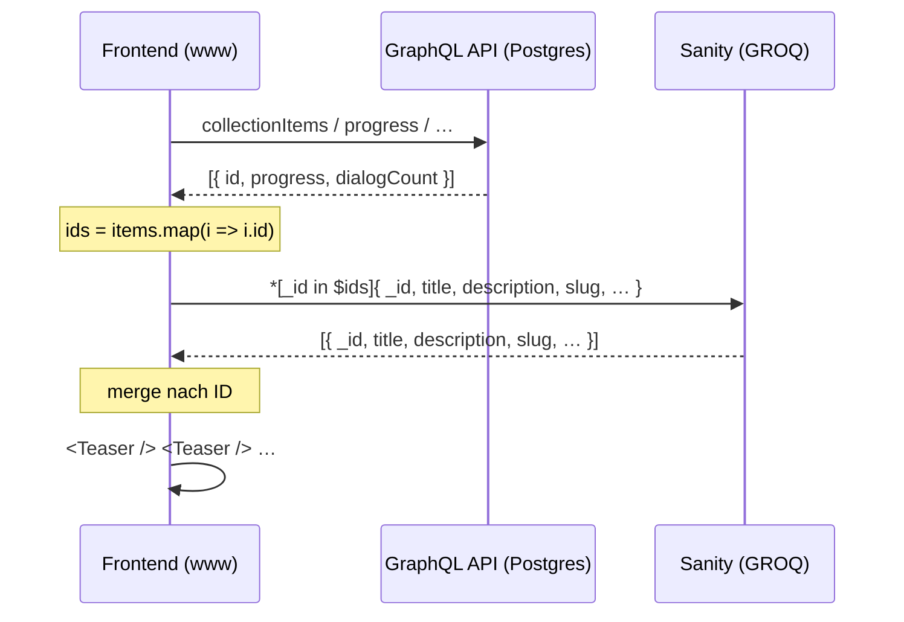

# Collections (Bookmarks, Reading Positions, Media Progress)

> Status: Entscheid vom Team, Umsetzung offen. Sprache: Deutsch (Rest der Doku ist
> englisch – bei Bedarf übersetzen).

Dieses Dokument beschreibt, wie nutzerbezogene Sammlungen (Lesezeichen,
Leseposition, Audio-Fortschritt, Audio-Queue) funktionieren sollen, sobald die
Inhalte aus Sanity und nicht mehr aus Publikator kommen.

## Ausgangslage

Es gibt zwei Datenquellen mit klar getrennter Verantwortung:

- **GraphQL API** (`apps/api`, PostgreSQL): alles Nutzerbezogene – wer hat was
  gemerkt, wie weit gelesen, wie weit gehört, wie viele Dialog-Beiträge.
- **Sanity** (GROQ): der Inhalt – Titel, Beschreibung, Bild, Format, Slug,
  Content.

Bisher lieferte die GraphQL API beides in einem Rutsch: Die
Collection-Resolver hängen am `Document`-Typ und geben das ganze
Publikator-Dokument mit `meta { title, description, image, format, series, … }`
zurück. Beispiele:

- `apps/www/graphql/republik-api/queries/NextReadBookmarksQuery.gql`
  → `me.collectionItems.nodes.document { ...NextReadDocumentFields }`
- `apps/www/graphql/republik-api/fragments/NextReadDocumentFields.fragment.gql`
  → ~40 Content-Felder pro Eintrag
- `apps/www/graphql/republik-api/AudioQueueOperations.gql`
  → `audioQueue.document.meta { … }`
- `apps/www/graphql/republik-api/queries/DocumentProgressQuery.gql`
  → Auflösung über `document(path:)`

## Problem

1. **Die API kennt den Inhalt nicht mehr.** Für Sanity-Artikel gibt es kein
   Publikator-Dokument, an dem `document { meta { … } }` hängen könnte. Die
   Collection-Queries würden für Sanity-Inhalte leer oder gar nicht auflösen.
2. **Kein Content-Duplikat in der API.** Titel/Bild/Format nach Postgres zu
   spiegeln, damit die alten Queries weiter funktionieren, hiesse zwei Quellen
   für dieselbe Wahrheit, plus Sync-Aufwand und Drift.
3. **Over-Fetching.** Für ein Teaser-Rendering wird das ganze Dokument geladen;
   die Feld-Definition liegt doppelt (GraphQL-Fragment *und* GROQ-Fragment).
4. **Zwei Caching-Modelle in einer Query.** Inhalt ist öffentlich und
   cachebar/revalidierbar, Nutzerdaten sind privat und nicht cachebar. In einer
   Response vermischt verliert man beides.

## Lösung

Der Datenfluss wird in zwei Schritte getrennt: **IDs von der API, Inhalt von
Sanity, Merge im Frontend.**



### 1. GraphQL: nur noch Nutzerdaten

Die Collection-Queries geben ausschliesslich zurück, was die API auch besitzt:

- die **ID** des Dokuments (Join-Key zu Sanity)
- **progress** (Leseposition bzw. Audio-Fortschritt)
- **dialogCount** (Anzahl Beiträge)
- Collection-Metadaten (`createdAt`, `sequence`, …)

Kein `document { meta { … } }` mehr. Filter und Sortierung (`first`,
`progress: UNFINISHED`, `lastDays`, `uniqueDocuments`, `excludeRepoId`,
`sequence`) bleiben in der API – sie hängen an den Nutzerdaten.

### 2. GROQ: Inhalt zu einer ID-Liste

Die zurückgegebenen IDs gehen als Array-Parameter in eine einzige GROQ-Query:

```groq
*[_type in ["article", "page"] && _id in $ids]{
  _id,
  title,
  description,
  "slug": slug.current,
  // … bestehendes Teaser-Fragment
}
```

Damit gilt die Feld-Definition der Teaser genau einmal, in den bestehenden
Fragmenten unter `apps/www/src/app/(sanity)/groq/` (z. B.
`teaser-small-fragment.ts`).

### 3. Merge im Frontend

Content aus Sanity wird per ID an die API-Items geklebt und als Teaser
gerendert. Zwei Regeln:

- **Reihenfolge kommt von der API**, nicht von GROQ. Die GROQ-Antwort ist nicht
  in `$ids`-Reihenfolge – also über eine `Map<id, content>` mergen und über die
  API-Liste iterieren.
- **Fehlende Dokumente werden gefiltert.** Gelöschte, unpublizierte oder noch
  nicht migrierte Inhalte fehlen in der GROQ-Antwort; solche Items dürfen die
  Liste nicht zerschiessen (heute: leerer Teaser / Crash).

## Konsequenzen

**Gewinn**

- Eine Wahrheit pro Belang: Nutzerdaten in Postgres, Inhalt in Sanity.
- Kleinere GraphQL-Payloads; die privaten Antworten enthalten nur noch IDs und
  Zahlen.
- Content-Abfragen laufen über Sanity und profitieren von dessen
  Caching/Revalidation.
- Teaser-Felder werden nur noch an einer Stelle definiert (GROQ).

**Kosten**

- Ein zusätzlicher Round-Trip (Wasserfall: erst IDs, dann Inhalt). Auf dem
  Server (RSC) parallelisierbar, sobald die IDs bekannt sind; im Client bedeutet
  es einen zweiten Ladezustand.
- Der Merge inkl. Reihenfolge und Lücken ist Frontend-Verantwortung.

## Offener Punkt: welche ID?

Der Join-Key muss auf beiden Seiten derselbe sein. Heute ist er das nicht:

- Bookmarks/Audio-Queue erwarten eine **base64-kodierte `repoId`** – siehe
  `apps/www/src/app/(sanity)/components/action-bar/document-id.ts`,
  das den Wert für `addDocumentToCollection` erzeugt, sowie den Resolver in
  `packages/backend-modules/collections`.
- Die Leseposition wird über den **`path`** aufgelöst
  (`document(path:) { userProgress }`), siehe
  `apps/www/src/app/(sanity)/components/action-bar/use-reading-position.ts`.
- Audio-Fortschritt hängt an einer **`mediaId`**.
- Sanity hat `_id`.

Voraussetzung für die Lösung ist deshalb, dass die Collections-API
Sanity-Dokument-IDs direkt akzeptiert und zurückgibt (Arbeit im Backend
angelaufen). Solange das nicht steht, bleibt `document-id.ts` die einzige
Stelle, die den Übergang kapselt.

## Betroffene Queries

Umzustellen (Content-Selektion raus, IDs rein):

- `NextReadBookmarksQuery.gql`, `NextReadsQuery.gql`,
  `DocumentRecommendationsQuery.gql` (+ `NextReadDocumentFields.fragment.gql`
  entfällt)
- `AudioQueueOperations.gql` (`AudioQueueItem`, `LatestArticles`)
- `DocumentProgressQuery.gql` / `ProgressMutations.gql` (ID statt `path`)
- `ArticleBookmarkQuery.gql` / `ArticleBookmarkMutations.gql` – liefern bereits
  nur `id` und `createdAt` und entsprechen dem Zielbild
