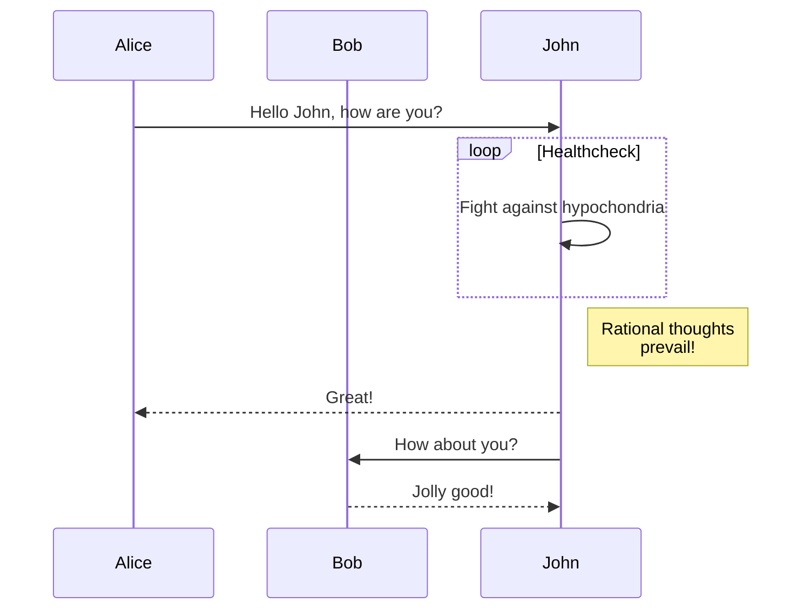

# App message-sync

## Description

> Our React-Native app contains a single webview that renders our webview.
> The webview can communicate with the app via the `window.postMessage` API.
> The app can communicate with the webview via the `message` events on the
> document element

Lorem ipsum dolor sit amet, consetetur sadipscing elitr, 
sed diam nonumy eirmod tempor invidunt ut labore et dolore magna aliquyam erat, 
sed diam voluptua. At vero eos et accusam et justo duo dolores et ea rebum. 
Stet clita kasd gubergren, no sea takimata sanctus est Lorem ipsum dolor sit amet. 
Lorem ipsum dolor sit amet, consetetur sadipscing elitr, sed diam nonumy 
eirmod tempor invidunt ut labore et dolore magna aliquyam erat, sed diam voluptua. 
At vero eos et accusam et justo duo dolores et ea rebum. 
Stet clita kasd gubergren, no sea takimata sanctus est Lorem ipsum dolor sit amet.

## Visualization

