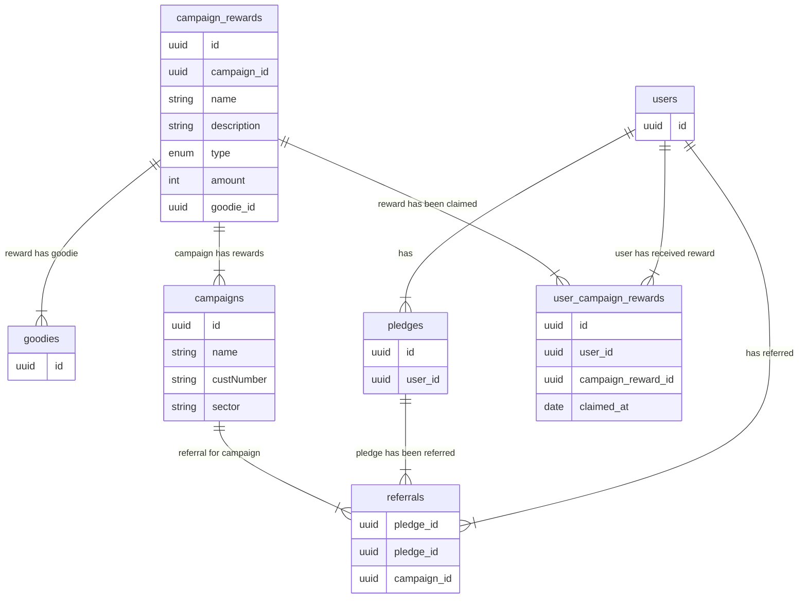
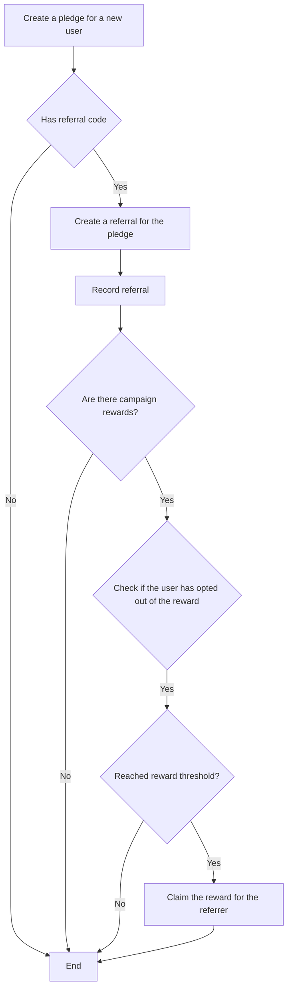

## Concept

The campaign features allows us to track the referrals of
a user within a campaign.
A campaign can have a set of rewards that can be claimed
by the user when they have reached a certain amount of referrals.
(eg. 1 referrals = 1 bonus month)

## Implementation

Referrals are created when a user creates a new pledge based on 
an invite link from another user.

## Data model

The data model for the campaign feature
is setup as follows:

## Flow

