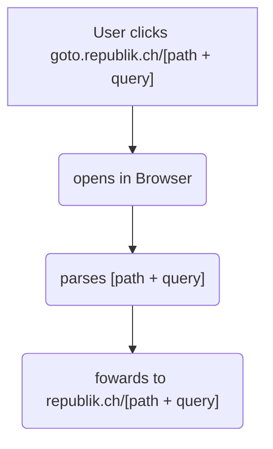

# goto documentation

import { Callout } from 'nextra-theme-docs'

<Callout type='warning' emoji='⚠️'>
  This is the documentation for our forwarding service "[goto](https://goto.republik.ch)".
  The documentation is still under construction.
</Callout>

## Overview

"goto" helps us to force a link in an [App](./app.mdx) to open in a browser.

## References

- [Linking](../architecture/linking.md)
