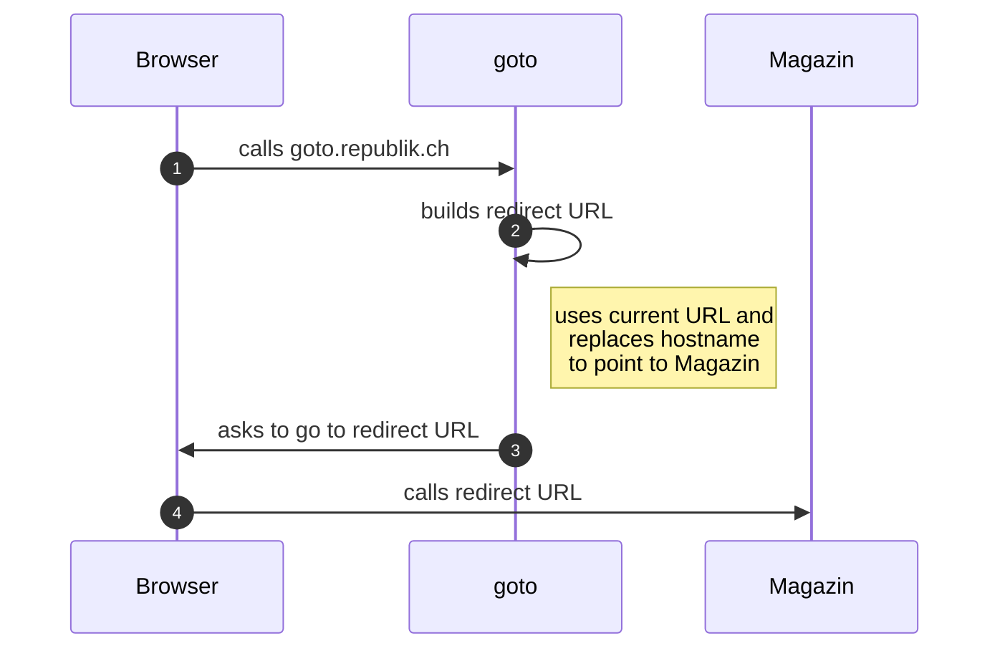

# goto documentation

import { Callout } from 'nextra-theme-docs'

<Callout type='warning' emoji='⚠️'>
  This is the documentation for our forwarding service "[goto](https://goto.republik.ch)".
  The documentation is still under construction.
</Callout>

## Overview

"goto" is a forwarding service.



## Use case

This services helps us to leave [App](./app.mdx) when clicking on a [Magazin](../applications/www.mdx) link.

If link is "goto-ified" – hostname is goto.republik.ch instead of www.republik.ch –, it will open in browser and forward to [Magazin](../applications/www.mdx).


### Examples

**Republik-Link within App**

```html
<a href="https://www.republik.ch/angebote" target="_blank">
  Angebote
</a>
```

On click will open /angebot inside app.

**Goto-Link withing App**

```html
<a href="https://goto.republik.ch/angebote" target="_blank">
  Angebote
</a>
```

On click will open browser and forward user to https://www.republik.ch/angebote.

### Redirecting in Browser instead of server

Some hostnames maybe registered to open in app (see [Linking](../architecture/linking.md)). A server-side redirect aka. `Location` HTTP header may indicated to OS to open app.

To prevent this from happening, we use [`window.location.replace`](https://developer.mozilla.org/en-US/docs/Web/API/Location/replace). 

It won't save goto-link in browser session history.

## References

- [Linking](../architecture/linking.md)
