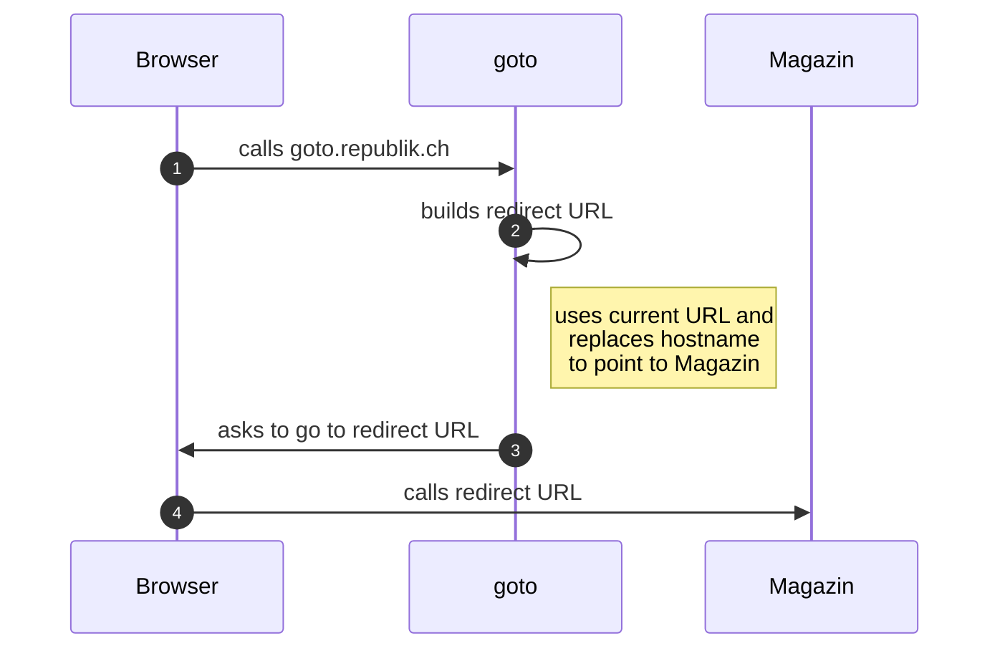

# goto documentation

import { Callout } from 'nextra-theme-docs'

<Callout type='warning' emoji='⚠️'>
  This is the documentation for our forwarding service "[goto](https://goto.republik.ch)".
  The documentation is still under construction.
</Callout>

## Overview

"goto" is a simple redirecting service.

It helps us to force a link in an [App](./app.mdx) to open in a browser.

Some destination hostnames maybe registered to open in app (see [Linking](../architecture/linking.md)). To prevent this from happening, we use [`window.location.replace`](https://developer.mozilla.org/en-US/docs/Web/API/Location/replace). A server-side redirect aka. `Location` HTTP header may cause OS to open app.

It won't save goto-link in browser session history.

## References

- [Linking](../architecture/linking.md)
