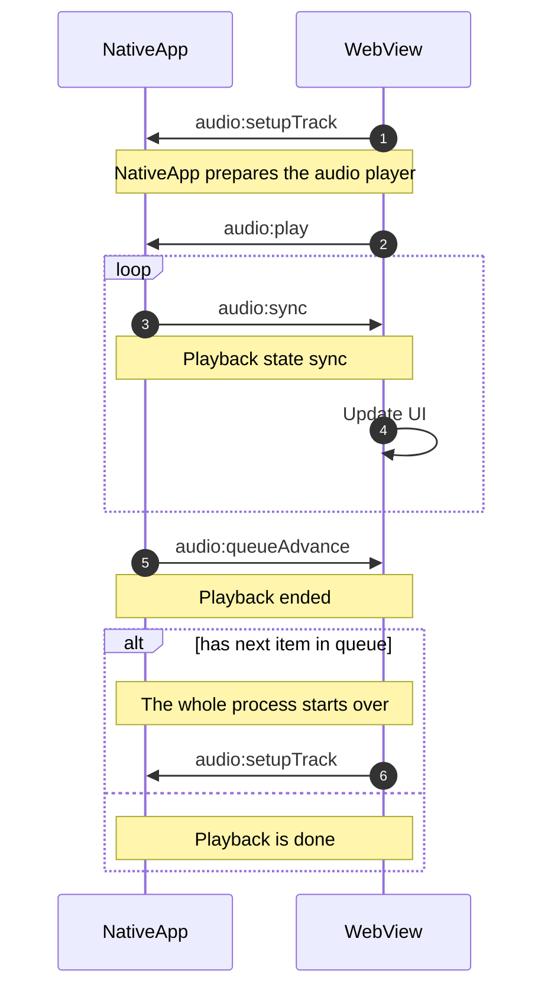

# The native app's headless audio player

When playing audio in the web audio-player, the native app is actually playing the audio,
while the web-view keeps on rendering the UI.
In order to the web-views UI in sync with the native app's audio player, the native app
sends frequent updates to the web-view about the current playing state.

In addition, when interacting with the lock-screen UI of the phone where the native-app is playing the audio,
the native-app forwords these interactions to the web-view, so that the web-view can update its UI accordingly.


## Events sent from the web-view to the native app

The web-view uses postMessage to send events to the native app.
The function `notifyApp` is used to send the events.

**Example:**

```ts
notifyApp(AudioEvent.SETUP_TRACK, {
  item,
  autoPlay,
  initialTime,
  playbackRate,
  coverImage: item.document.meta.coverForNativeApp,
})
```
### Events

| Event name | Description |
| ---------- | ----------- |
| `audio:play` | The user pressed the play button |
| `audio:pause` | The user pressed the pause button |
| `audio:seek` | The user seeked to a new position in the audio |
| `audio:stop` | The user has closed the audio-player, the playback should be stopped |
| `audio:foward` | Skip ahead x seconds |
| `audio:backward` | Skip back x seconds |
| `audio:playbackRate` | Change the playback rate |
| `audio:setupTrack` | Prepare the audio player for playing the given track |


## Events received in the webview, sent from the native-app

In order to receive events from the native app, the react-hook `useNativeAppEvent` is used.

**Example:**

```ts
useNativeAppEvent<string>(
  AudioEvent.QUEUE_ADVANCE,
  async (itemId) => {
    const isHeadOfQueue =
      audioQueue && audioQueue.length > 0 && audioQueue[0].id === itemId
    const isActiveItem = activePlayerItem && activePlayerItem.id === itemId
    if (isHeadOfQueue || isActiveItem) {
      // HasOptedOutFromAutoPlay might be null, which should then result in 'true'
      await onQueueAdvance(isAutoPlayEnabled)
    }
  },
  [initialized, activePlayerItem, isAutoPlayEnabled],
)
```

Most of the communication received by the web-view is handled in the [AudioPlayerController](https://github.com/republik/plattform/blob/main/apps/www/components/Audio/AudioPlayerController.tsx) component.

### Events

| Event name | Description |
| ---------- | ----------- |
| `audio:sync` | Sent every frequently, contains the current playing state used to keep the web-view in sync with the native app |
| `audio:queueAdvance` | The native app reports that the playback has finished and a next track should be sent if in the queue |
| `audio:error` | The native app reports an error |
| `audio:track` | The native app reports the current track |
| `audio:minimizePlayer` | The native app reports that the audio player should be minimized |

## Example message flow




## References

- [react-native-track-player](https://rntp.dev/)

- [postMessage docs](https://github.com/react-native-webview/react-native-webview/blob/master/docs/Reference.md#postmessagestr)

- [react-native onMessage](https://github.com/react-native-webview/react-native-webview/blob/master/docs/Reference.md#onmessage)

