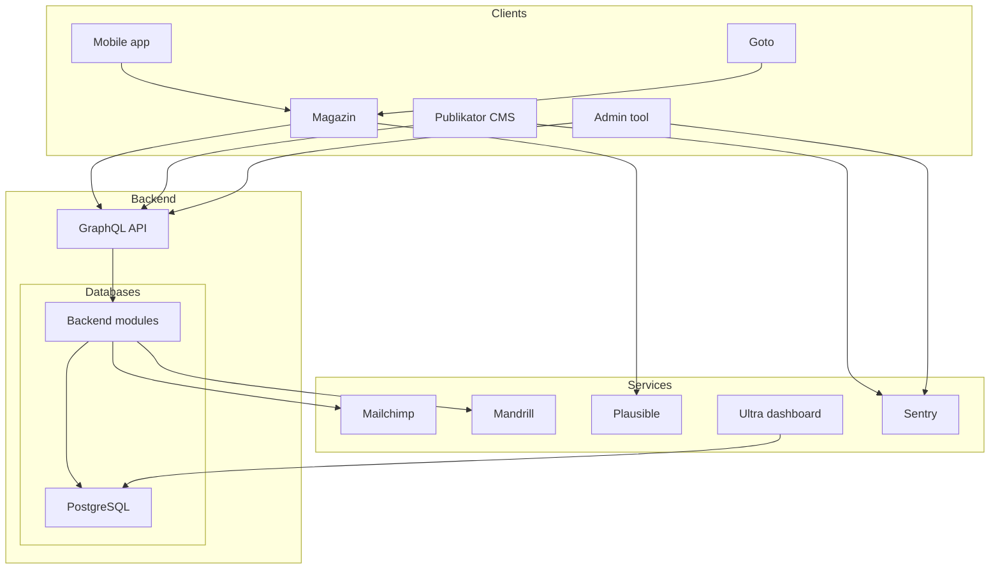

# Architecture

## Systems

## Tools / Services

| Service | Description | Self hosted |
| --- | --- | --- |
| [Mailchimp](https://mailchimp.com/) | Newsletters |  |
| [Mandrill](https://mandrillapp.com/) | Transactional emails |  |
| [Plausible](https://plausible.io/) | analytics tool | ✅ |
| [Ultra dashboard](https://ultra-dashboard.com/) | data analysis tool | ✅ |
| [Sentry](https://sentry.io/) | Error tracking (only in internal tools) |  |
| [DatoCMS](https://www.datocms.com/) | Headless CMS for the website |  |

