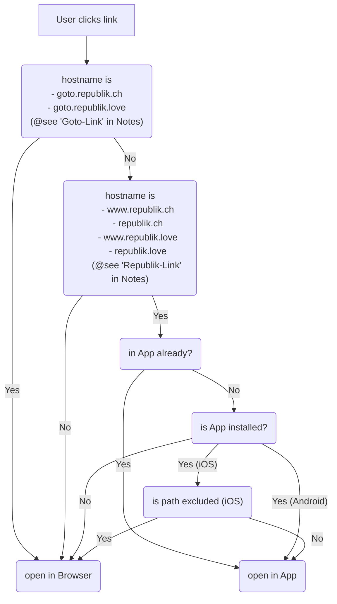

# Linking

This document describes how links will open, as it is not intuitive.

## Overview

## Notes

### Goto-Link

A "Goto-Link" points to a [goto](../applications/goto.mdx) instance (and comes with some [caveats](../applications/goto.mdx#caveats)).

### Republik-Link

A "Republik-Link" is a link which has a hostname in [republikapp.entitlements](https://github.com/republik/app/blob/main/ios/republikapp/republikapp.entitlements) (iOS version), and schema and hostname in [AndroidManifest.xml](https://github.com/republik/app/blob/main/android/app/src/main/AndroidManifest.xml) (Android version).

### "is path excluded?"

A path on iOS maybe excluded via [.well-known/apple-app-site-association](https://github.com/republik/plattform/blob/main/apps/www/public/.well-known/apple-app-site-association).

## References

- [goto](../applications/goto.mdx) app
