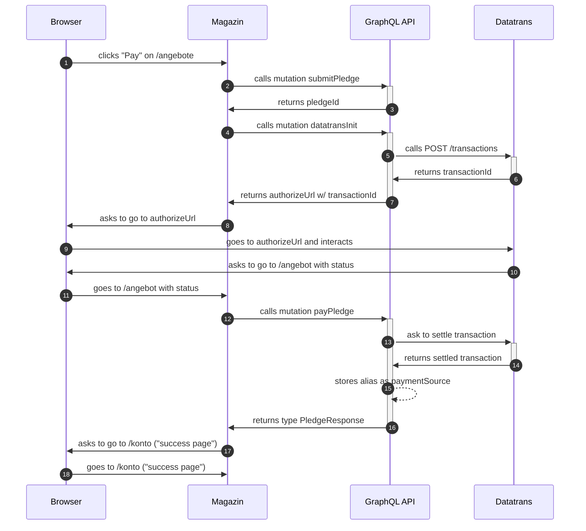
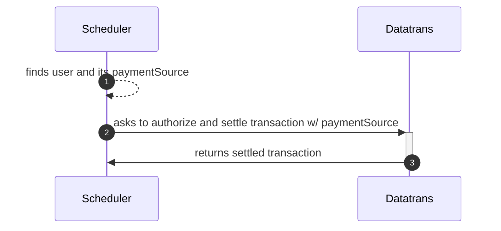

# Datatrans

Datatrans authorizes and settles transactions.

## User initiated flow

Flow shows a successful payment of a pledge.

## AutoPay flow

Flow shows successful automated payment without user interaction.

