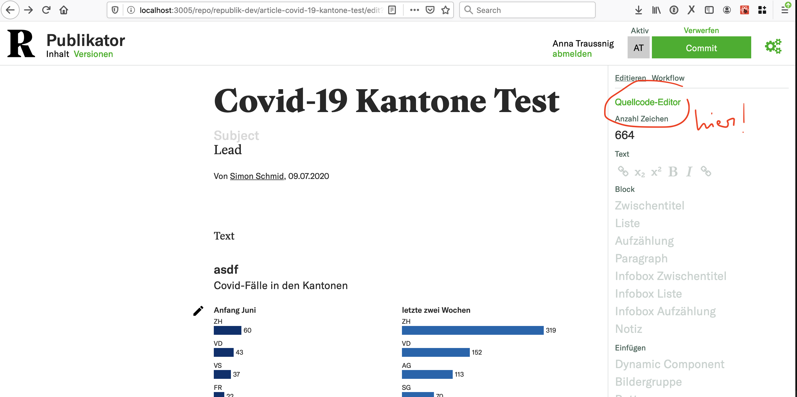
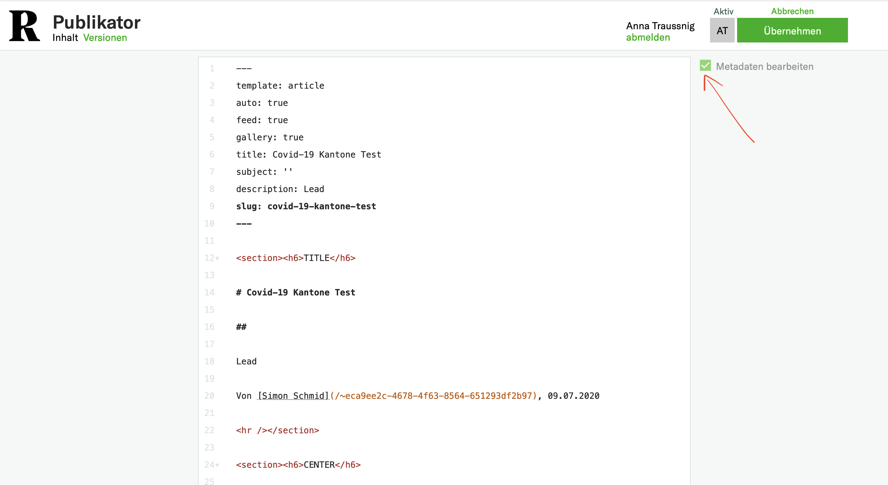
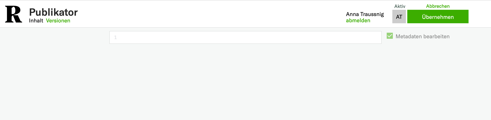
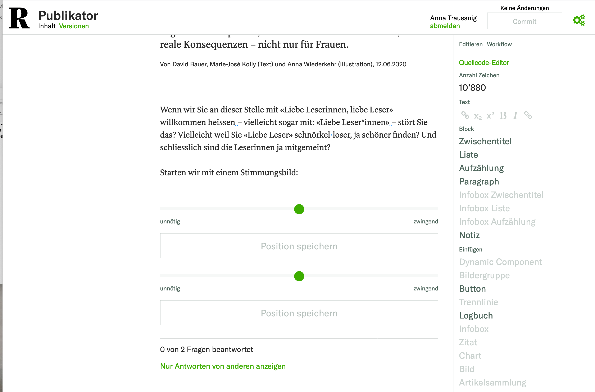
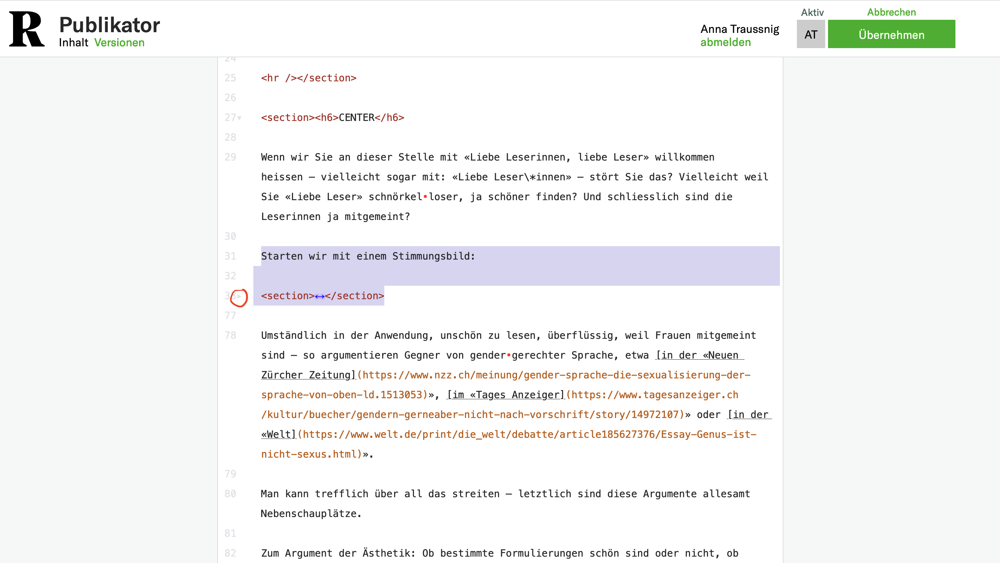
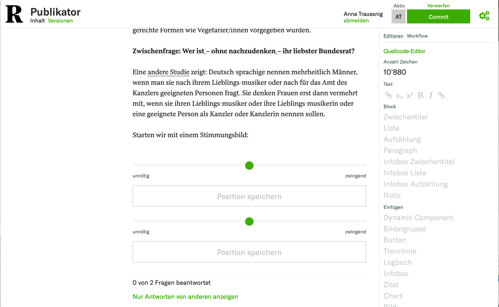

# Quellcode-Editor

Das Quellcode-Editor ist durch einen Link im Sidebar von normalen Editor zugänglich: 
> 

Es gibt 2 wichtige Usecases dafür:

* [Templating](#Templating): bestehende Dokumente kopieren und als Muster für neue Dokumente verwenden
* [Copy-paste](#copy-paste): komplexe Elemente (z.B. Liste, Infoboxen) in einem Dokument verschieben

## Templating

Bestehende Dokumente kopieren und als Muster für neue Dokumente verwenden, how-to.

- Im Dokument, was zu kopieren ist, rein, und im Quellcode-Editor.

- Metadaten einblenden:
> 

- Im Editior rein (einfach drauf clicken), das ganze Inhalt selektieren (ctrl-A/cmd-A funktioniert auch) und kopieren:
> 

- Neues Dokument erstellen oder im Dokument rein, was die Template verwenden soll.

- Quellcode-Editor aufmachen.

- Metadaten einblenden.

- Existierendes Text selektieren und löschen.
> 

- Inhalt von 3. reinpasten.

- Änderungen übernehmen:
> 

- Et voila!

## Copy-paste

Komplexe Elemente im selben Dokument verschieben. Hier wollen wir z.B. diese Umfrage im Mitte des Artikel bewegen:
> 
 

- Im Quellcode-Editor rein.

- Das relevante Teil finden:
> 

- Das Teil kopieren. Lange `<section>...</section>` können durch das `>` Zeichen auf der  link Seite kompressiert werden:
>  

- Irgendwo anders pasten:
>  

- Änderungen übernehmen:
> 

- Et voila!
>  
